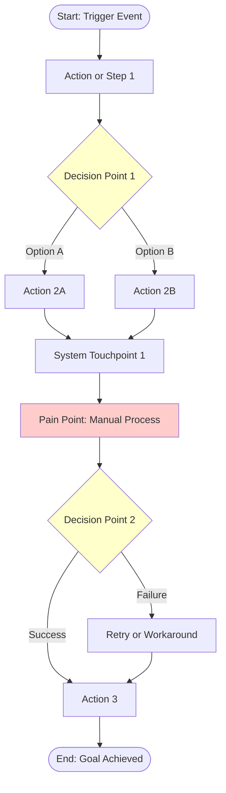

# Mermaid Journey Diagram: [Scenario Name]

## Diagram

## Diagram Legend

- **Rectangles** — Actions or steps
- **Diamonds** — Decision points (branching)
- **Rounded boxes** — Start/end states
- **Red-tinted** — Pain points or friction
- **Yellow-tinted** — Decision nodes

## Mapping to Journey Artifact

| Diagram Element | Journey Stage | Notes |
|-----------------|---------------|-------|
| Start | [Stage name] | [Trigger condition] |
| Action1 | [Stage name] | [What happens] |
| Decision1 | [Stage name] | [Decision criteria] |
| PainPoint1 | [Stage name] | [Specific friction] |
| End | [Final stage] | [Outcome] |

## Validation Checklist

- [ ] All journey stages represented in diagram
- [ ] All decision points from journey included
- [ ] All pain points marked in diagram
- [ ] No invented steps absent from journey
- [ ] Mermaid syntax validated
- [ ] All branches have resolution paths
