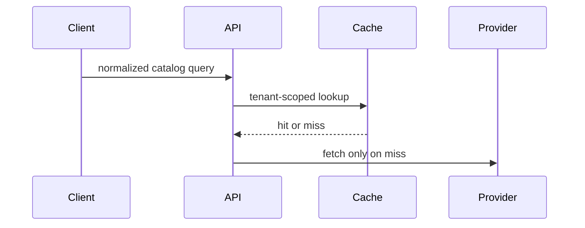

# Visual explanations for PR descriptions

Use a compact visual aid only when it makes a non-obvious causal, control-flow, data-flow, UI-structure, or file-responsibility relationship easier to check than prose alone. It is an aid to the reader, not a substitute for the PR description's argument.

## Boundaries

- Choose the smallest form that makes the one relevant point clear. Most PRs need no visual aid; a PR that needs one normally needs only one focused aid.
- Put the aid directly beside the short prose it supports. Introduce the point in prose, show the structure, then state any conclusion or boundary the reader needs.
- Use only facts established by the branch, supplied context, or cited evidence. Do not invent actors, states, calls, files, metrics, or outcomes to make a diagram feel complete.
- Keep the repository PR template authoritative. Do not add a heading when its required structure has no place for one; use the template's allowed prose, fenced block, table, or existing `## Before / after` section instead.
- A visual never replaces reader-oriented causal prose, a required literal signature/call-site/config excerpt, validation evidence, or the required test plan. When the changed idea is a literal signature, request/response, call shape, config key, flag value, or exact wording, show that literal form directly.
- Use text-native Markdown aids that are ready to paste into the PR. Do not create, open, or link to an HTML artifact.

## Pick a form from the claim

### Rule or state transition: pseudocode

Use a small pseudocode block when the reviewer needs to see the decision order or invariant.

```text
on(cache lookup)
  if key matches tenant + normalized query + locale
    return cached catalog for 15 minutes
  fetch from provider
  populate cache
```

Show only the states and branches needed to judge the change. Keep error and fallback paths when they establish the stated boundary.

### Runtime flow: call tree

Use a call tree when the important point is ownership or call order.

```text
handleRequest
  normalizeQuery
  lookupCatalogCache
    return cached result
  fetchCatalogProvider
```

Do not use it to list every helper. Preserve literal call sites separately when the exact call shape is material evidence.

### UI or module boundary: component tree

Use a component tree for a UI change when state ownership or package boundaries explain the behavior.

```text
<CatalogPage>
  useCatalogQuery()
  <CatalogFilters>
  <CatalogResults> (renders cached or fetched rows)
```

Name only the state, props, or module boundary needed to evaluate the change.

### Broad responsibility change: shallow file tree

Use a shallow file tree for a refactor when responsibility moves across a few paths.

```text
src/
├── cache/          # owns tenant-scoped keys and TTL
├── catalog/        # fetches on cache misses
└── api/            # maps requests to catalog reads
```

Do not turn it into a file list. State the responsibility or boundary each shown path establishes.

### Interaction or data flow: Mermaid

Use Mermaid only when the repository host renders it and a sequence or flow is clearer than the compact text forms above.



Keep participants and edges limited to the claim under review. Put known fallbacks or boundaries in the supporting prose when they would make the diagram noisy.

### Existing shape changed: diff or before/after

Use a `diff`, short fenced block, or table when the point is the shape that changed and the reader needs a direct comparison.

```diff
- cacheKey = query
+ cacheKey = tenantId + normalizedQuery + locale
```

Use the literal before/after text from the diff. For a signature, import-path, or call-shape change, follow the skill's existing `## Before / after` guidance.

### New implementation shape: complete small block

Show the whole small block when most of it is new, omitted context would hide ownership or order, or the reviewer needs a copyable target shape. Do not use a partial visual when the missing lines carry the invariant or fallback being claimed.

## Final check

Before delivery, remove a visual aid that merely decorates, repeats the prose, or makes a bounded fix longer without making it more checkable. Keep an aid only when a reviewer can identify the intended relationship faster and still find every required literal artifact, scope boundary, and validation detail in the PR body.
